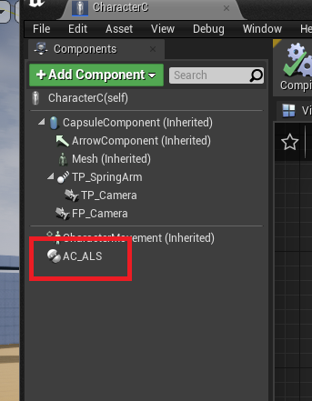
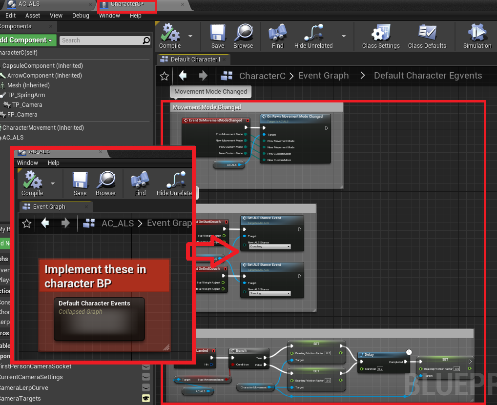
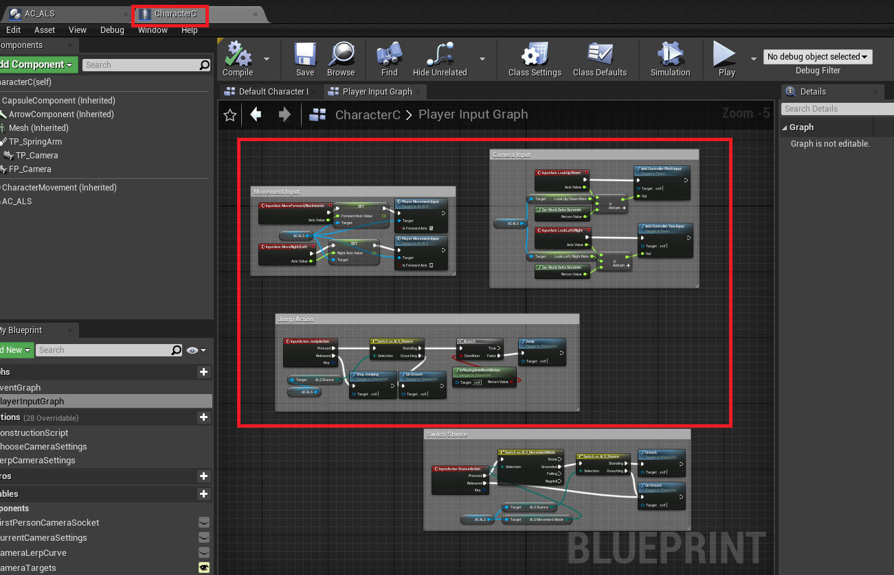

# ALSv3 Component (Replicated)

The original ALSv3 turned into a easily usable component which can be used in Characters

Instructions
- Add the ALS component to your character

- Make sure you are using ALSAnimBP with  
- Copy Character events from ALS component to CharacterBP

- Simple examples of character control

License
----
Credits goes to the original author *LongmireLocomotion*
You must have ALS in your account
https://www.unrealengine.com/marketplace/en-US/product/advanced-locomotion-system-v1
Please check Epic Games Marketplace License
https://www.unrealengine.com/en-US/marketplace-faq

**Free Software, Hell Yeah!**
